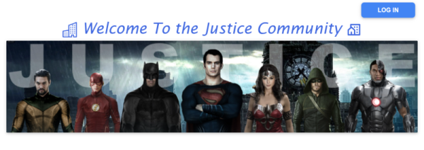
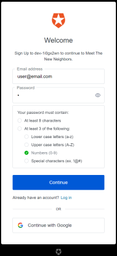
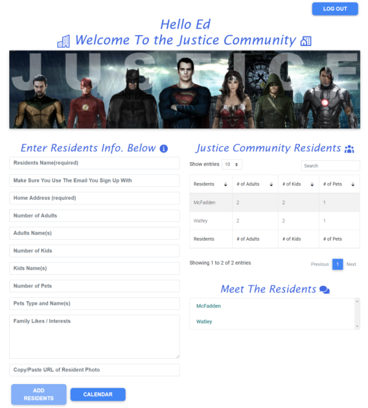
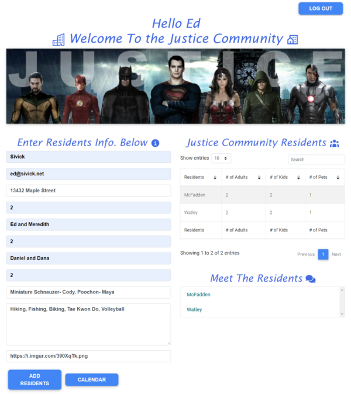
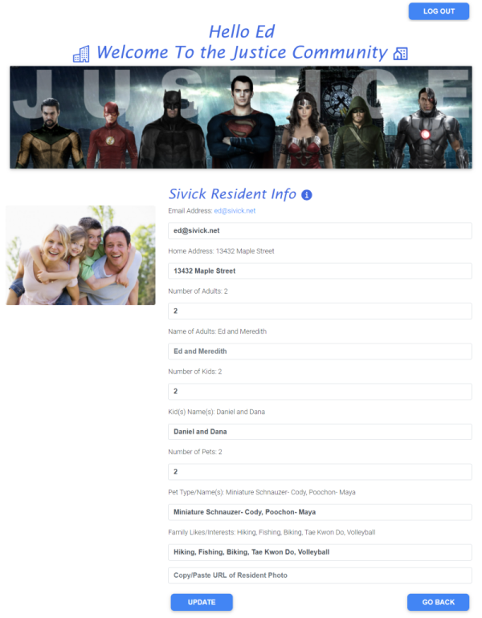
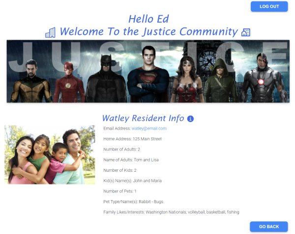
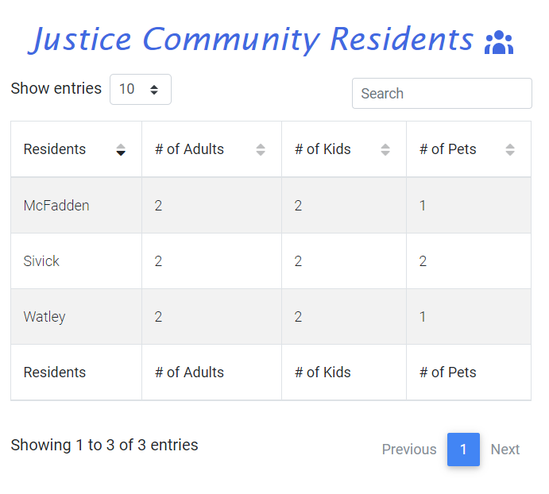
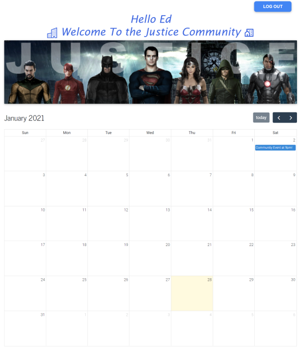

# Project 3-Meet The New Neighbors
____
## Table of Contents
* [Description](#description)
* [User_Story](#user_story)
* [Installation](#installation)
* [Usage](#usage)
* [Technologies/Packages Used](#technologies_packages_used)
* [Contributing](#contributing)
* [Questions](#questions)
* [License](#license)
* [Application_Links_and_Images](#application_links_and_images)
____
## Description
The COVID-19 pandemic has been an obstacle for many social activities in our lives.  When people move to a new community, there are many who are nervous and prefer to avoid meeting their new neighbors face to face, especially in retirement communities.  The ‘**Meet The New Neighbors**’ App allows each participant to introduce themselves, and their family members to others within their community.  The Home Owners Association or apartment manager would provide each new resident with a link to the App.  The user inputs specific details such as contact information, interests, hobbies, pets, etc..  They can also view the details of others, and schedule activities with those having similar interests. 
____
## User_Story:
AS individuals or families move to a new neighborhood or apartment complex   
THEY want to meet other neighbors within their community or building.   
WHEN they are presented with an app that provides personal details of other neighbors,   
THEY can contact them to schedule events of similar interest.
____
## Installation 
(1) Clone the repository   
(2) Go to the root folder in VS Code, right-click, select **Open in Integrated Terminal** and type: **npm i** (install) which will install all required dependencies for the App, creating the **node modules** folders and **package-lock.json** files for the client and server side.   
(3) Type **npm run seed** to initialize the MongoDB database (familyList).   
(4) Type **npm start** to invoke the App.     
(5) The App will automatically open the webpage on **localhost:3000**, displaying the **Meet The New Neighbors** App on the Client side (front end).  The Server side (back end) will be running on **localhost:3001**.
(6)  
_____
## Usage 
This App allows new members of a community to introduce themselves to others in that community without making direct contact.  When the App is opened, the User will **Log In** to add or view community resident information. They must **Log In** or **Sign Up** to create an account with Auth0.  The **Continue with Google** option was included during App development.  Although the Google option will also allow the User to Log In, it is suggested to use the Auth0 credentials.    

After logging in, they can enter details about themselves and their family on the left side of the display.  A resident photo can be uploaded to ([imgur](https://imgur.com/)), and they can copy the **Direct Link** of the photo to the Resident Info. form. After entering their information, the user posts it to the database by pressing the **ADD RESIDENTS** button. The user can also edit or UPDATE their profile information at any time.  Several members of the same residence can create their own profile.

The User has the ability to **Meet The Residents** in the community by selecting their name from the list on the lower right side of the display.  This will GET the **Resident Info.** and the display screen will appear showing the information of the other residents, and allow the user to communicate with them by clicking on their email link.   

 A search table is displayed on the right side of the display showing the names of the **Residents**, **# of Adults**, **# of Kids**, and **# of Pets**.  The table can be sorted alphabetically, or the user can Search for the name of a specific resident.   

For future project development, a calendar showing public community events is displayed by pressing the **CALENDAR** button.  This would show events to be held on specific calendar days from the past, current, or future months.  

_____
## Technologies_Packages_Used 
- ReactJS
- Node and Express Web Server
- MongoDB and Atlas
- Robo 3T
- React Bootstrap with Material Design ([mdbreact npm package](https://www.npmjs.com/package/mdbreact)) - used for creating Resident Table   
- React Icons ([react-icons npm package](https://www.npmjs.com/package/react-icons)) - icons displayed before / after text headings   
- React Calendar ([react-calendar npm package](https://www.npmjs.com/package/react-calendar)) - used for creating Calendar   
- Auth0 React for single page user authentication ([@auth0/auth0-react npm package](https://www.npmjs.com/package/@auth0/auth0-react)) - used for creating Log In / Log Out   
- favicon.io generates favicon ICO files from PNG, Text, or Emoji ([favicon.io](https://favicon.io/)) - used to create the App shortcut icon
- Heroku
_____
## Contributing
Muhammad Anas, Malcolm McFadden, Ed Sivick, Eric Wilder, BCS Units 19-21 class documentation, Stack Overflow, auth0, W3Schools.com, Instructor Lada along with TAs Stephen and Ashley for help with App functionality and code syntax
_____
## Questions
If there are any questions, or if you would prefer more information concerning this app,
please contact the following person(s) at their GitHub profile:

* [Muhammad Anas GitHub Profile](https://github.com/anasm23)
* [Malcolm McFadden GitHub Profile](https://github.com/MalcolmYates34)
* [Ed Sivick GitHub Profile](https://github.com/ed-sivick)
* [Eric Wilder GitHub Profile](https://github.com/Eric-Wilder)
_____
## License
You can view more information concerning software licenses at the following link:

* [License](https://opensource.org/licenses/MIT)
_____
## Badges

_____
## Application_Link_and_Images  
**Links:**  
Heroku link: ([meet the new neighbors](https://murmuring-shore-40796.herokuapp.com/))

**Application Image Examples:**   
 

<strong>Image of App Startup display</strong>
   

  
  

    

  
<strong>Image of Welcome/Log in screen</strong>

  

  
  

    

  
<strong>Image of App Welcome display</strong>
   

  
  

    

  
<strong>Image of Resident Info. input screen</strong>

  

  
  

    

  
<strong>Image of User Resident Info.</strong>

  

  
  

    

  
<strong>Image of Resident Info.</strong>

  

  
  

    

<strong>Image of Residents Table</strong>

  

  
  

    

  
<strong>Image of Community Events Calendar</strong>

  

  
  

    